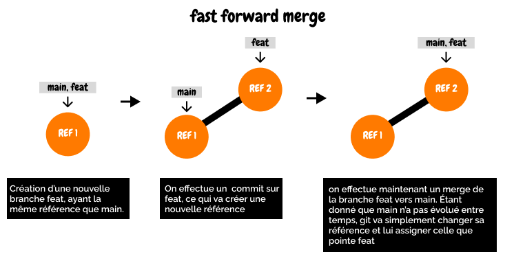

# CHEATSHEET GIT
---

## SWITCH

| Commande | Explications |
| - | - |
| `git switch <branche>` | **Changer de branche**|
| `git switch -c <branche>`| **Créer une branche et basculer directement sur celle-ci** |

## CHECKOUT

| Commande | Explications |
| - | - |
| `git checkout <branche>` | **Changer de branche**|
| `git checkout -b <branche>`| **Créer une branche et basculer directement sur celle-ci** |

## LOG

| Commande | Explications |
| - | - |
|`git log` | **Afficher un log des commits jusqu'à HEAD** | 
|  `git log --all` | **Afficher un log de tous les commits** |
| `git log --oneline` | **Formater l'affichage des logs sur une ligne** |

## COMMIT

| Commande| Explications |
| - | - |
| `git commit -am "<message>"` |  **Stage et commit tous les fichiers modifiés.** Cela ne remplace pas un `git add .` suivi d'un commit car le flag `-a` va stage seulement les fichiers suivis alors que `git add .` va aussi prendre les nouveaux fichiers en compte |
|  `git commit --amend` | **Remplace le précédent commit.** Le nouveau commit contiendra les changements qu'on a stage en plus de ceux du précédent commit. Le hash sera différent. Si on veut changer le nom du commit, on peut rajouter `-m <message>`. Au contraire, si on veut juste ajouter des changements en gardant l'ancien message, on peut ajouter `--no-edit`|

## DIFF

| Commande| Explications |
| - | - |
| `git diff` | **Voir les changements  des fichiers suivis mais pas encore stage**  |
| `git diff HEAD` | **Voir tous les changements des fichiers suivis depuis HEAD** |
| `git diff --staged` ou `git diff --cached` | **Voir les changements qui ont été staged** |
| `git diff <fichier1> <fichier2> <etc...>` | **Voir les changements dans un ou plusieurs fichiers précis** |
|  `git diff <branche1> <branche2>` ou `git diff <branche1>..<branche2>` | **Comparer les différences sur le dernier commit pointé dans les 2 branches.** possibilité de faire la comparaison sur un ou plusieurs fichiers précis en rajoutant les noms de fichiers à la suite|
| `git diff <commit1> <commit2>` ou `git diff <commit1>..<commit2>`|**Voir les changements entre 2 commits.** Il est aussi possible de ne citer qu'un seul commit et par défaut ça fera une comparaison de ce commit a HEAD, exemple `git diff HEAD~1` va comparer les changements entre le dernier commit et HEAD

# STASH

| Commande| Explications |
| - | - |
| `git stash` | **Retirer et stocker les derniers changements.** Si on veut également ajouter les fichiers non indexés au stash, on peut rajouter l'argument `-u` |

## INFOS COMPLÉMENTAIRES
---

## Merging

 

